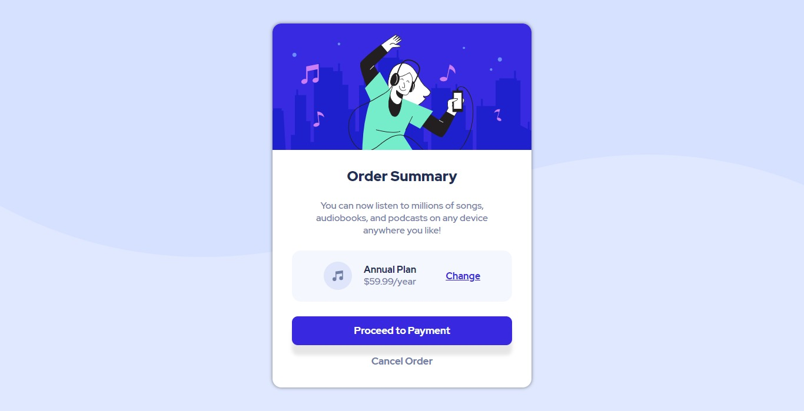

# Frontend Mentor - Order summary card solution

This is a solution to the [Order summary card challenge on Frontend Mentor](https://www.frontendmentor.io/challenges/order-summary-component-QlPmajDUj). Frontend Mentor challenges help you improve your coding skills by building realistic projects. 

## Table of contents

- [Overview](#overview)
  - [The challenge](#the-challenge)
  - [Screenshot](#screenshot)
  - [Links](#links)
- [My process](#my-process)
  - [Built with](#built-with)
  - [Continued development](#continued-development)
  - [Useful resources](#useful-resources)
- [Author](#author)

## Overview

### The challenge

Users should be able to:

- See hover states for interactive elements

### Screenshot

### Links

- Solution URL: [Add solution URL here](https://your-solution-url.com)
- Live Site URL: https://luizhf42.github.io/order-summary-component/

## My process

### Built with

- HTML5 Markup
- CSS3
- Flexbox
- CSS Grid
- CSS Media Queries

### Continued development

I'm going to keep focusing on best practices, Flexbox and media queries, some necessary things I'm not that familiar with yet.

### Useful resources

- [Media Queries Reference (MDN Web Docs)](https://developer.mozilla.org/en-US/docs/Web/CSS/Media_Queries/Using_media_queries) - This helped me to use media queries, making a first and simple try.

## Author

- Frontend Mentor - [@luizhf42](https://www.frontendmentor.io/profile/luizhf42)
